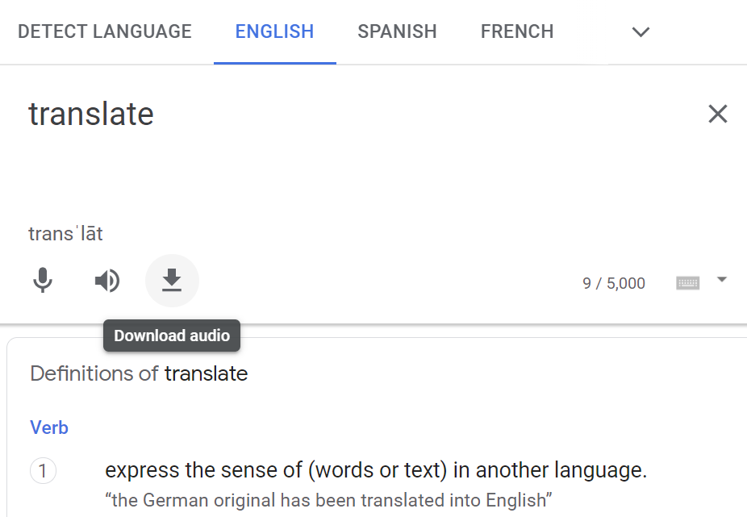

# Download Google Translate Audio
A helpful utility for learning a language or just getting text-to-speech.



## Known Issues
Chrome has a [bug](https://bugs.chromium.org/p/chromium/issues/detail?id=1024211) that stops the
extension from working after ~2 minutes when the service worker sleeps. A few changes are needed
to migrate the extension from Manifest V3 to V2 to work around the bug, but I'm yet to master the
will to do it. Reload the extension if you stopped using it for more than 2 minutes. 😅

## Development
```
# Install dependencies
npm install
```
```
# Build
npm run build
```

Output of the build will be located in `./patootie/output`.